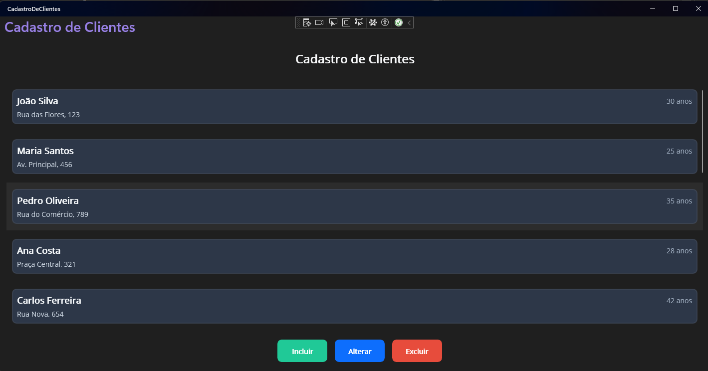

# 📋 Cadastro de Clientes - .NET MAUI



Sistema completo de cadastro de clientes desenvolvido em .NET MAUI 9 para Windows, utilizando o padrão MVVM, injeção de dependência, persistência SQLite e testes unitários.

## 🚀 Funcionalidades Principais

- ✅ **Incluir Cliente**: Formulário completo com validação avançada de campos
- ✅ **Alterar Cliente**: Edição de dados de clientes existentes
- ✅ **Excluir Cliente**: Exclusão com confirmação de segurança
- ✅ **Listar Clientes**: Visualização em lista moderna e responsiva
- ✅ **Navegação**: Entre telas com fechamento automático
- ✅ **Validação Avançada**: Campos com regex e mensagens de erro inteligentes
- ✅ **Persistência SQLite**: Dados salvos permanentemente no banco
- ✅ **Testes Unitários**: 39 testes cobrindo todos os componentes
- ✅ **Interface Moderna**: UI/UX otimizada com tema escuro

## 🏗️ Arquitetura

O projeto segue o padrão **MVVM (Model-View-ViewModel)** com:

- **Models**: Classe `Cliente` com propriedades Name, Lastname, Age, Address
- **Views**: Telas XAML responsivas e modernas
- **ViewModels**: Lógica de negócio e binding com as views
- **Services**: Serviço de dados em memória com operações CRUD
- **Dependency Injection**: Configuração completa de DI

## 🛠️ Tecnologias Utilizadas

- **.NET 9** - Framework principal
- **.NET MAUI** (Multi-platform App UI) - Framework de interface
- **WinUI 3** (Windows UI Library) - Biblioteca de UI nativa
- **SQLite-net-pcl** - Persistência de dados
- **CommunityToolkit.Mvvm** - Implementação MVVM
- **MVVM Pattern** - Padrão arquitetural
- **Dependency Injection** - Inversão de controle
- **xUnit** - Framework de testes
- **Moq** - Biblioteca de mocking
- **FluentAssertions** - Assertions fluentes para testes
- **XAML** - Linguagem de marcação para interfaces

## 📁 Estrutura do Projeto

```
CadastroDeClientes/
├── Models/
│   └── Cliente.cs                 # Modelo de dados do cliente
├── Views/
│   ├── MainPage.xaml             # Tela principal com lista
│   ├── IncluirClientePage.xaml   # Tela de inclusão
│   └── AlterarClientePage.xaml   # Tela de alteração
├── ViewModels/
│   ├── BaseViewModel.cs          # Classe base para ViewModels
│   ├── MainPageViewModel.cs      # ViewModel da tela principal
│   ├── IncluirClienteViewModel.cs # ViewModel de inclusão
│   └── AlterarClienteViewModel.cs # ViewModel de alteração
├── Services/
│   ├── IClienteService.cs        # Interface do serviço de clientes
│   ├── ClienteService.cs         # Implementação do serviço
│   ├── IDatabaseService.cs       # Interface do serviço de banco
│   └── DatabaseService.cs        # Implementação SQLite
├── Helpers/
│   ├── ValidationHelper.cs       # Validações com regex
│   └── StringToBoolConverter.cs  # Conversor para XAML
├── Converters/
│   └── StringToBoolConverter.cs  # Conversores XAML
└── CadastroDeClientes.Tests/     # Projeto de testes unitários
    └── UnitTestsSuite.cs         # 39 testes unitários
└── MauiProgramExtensions.cs      # Configuração de DI
```

## 🔧 Pré-requisitos

- **Visual Studio 2022** (versão 17.8 ou superior)
- **.NET 9 SDK**
- **Workload do .NET MAUI** instalado
- **Windows 10/11** (versão 1809 ou superior)

## 🚀 Como Executar

### 1. Clone o repositório
```bash
git clone https://github.com/[SEU-USUARIO]/CadastroDeClientes.git
cd CadastroDeClientes
```

### 2. Restaurar dependências
```bash
dotnet restore
```

### 3. Compilar o projeto
```bash
dotnet build CadastroDeClientes\CadastroDeClientes.WinUI\CadastroDeClientes.WinUI.csproj -p:Platform=x64
```

### 4. Executar a aplicação
```bash
dotnet run --project CadastroDeClientes\CadastroDeClientes.WinUI\CadastroDeClientes.WinUI.csproj -p:Platform=x64
```

### Alternativa - Visual Studio
1. Abra o arquivo `CadastroDeClientes.sln` no Visual Studio
2. Defina `CadastroDeClientes.WinUI` como projeto de inicialização
3. Selecione a plataforma `x64`
4. Pressione `F5` para executar

## Testes Unitários

O projeto inclui uma suíte completa de **39 testes unitários** que garantem a qualidade e confiabilidade do código:

### Cobertura de Testes

- **Cliente Model** (2 testes) - Propriedades e inicialização
- **ValidationHelper** (24 testes) - Todas as validações com regex
- **ClienteService** (3 testes) - CRUD operations e eventos
- **ViewModels** (8 testes) - MainPage, Incluir e Alterar ViewModels
- **DatabaseService** (2 testes) - Inicialização e persistência SQLite

### Executar Testes

```bash
# Executar todos os testes
dotnet test CadastroDeClientes.Tests\CadastroDeClientes.Tests.csproj

# Com saída detalhada
dotnet test CadastroDeClientes.Tests\CadastroDeClientes.Tests.csproj --verbosity normal

# Com logger do console
dotnet test CadastroDeClientes.Tests\CadastroDeClientes.Tests.csproj --logger "console;verbosity=detailed"
```

### Resultados dos Testes

- **Total**: 39 testes
- **Aprovados**: 39 (100%)
- **Tempo de execução**: ~2 segundos
- **Frameworks**: xUnit, Moq, FluentAssertions

## Como Executar

### Pré-requisitos

- Visual Studio 2022 (versão 17.8 ou superior)
- .NET 9 SDK
- Workload do .NET MAUI instalado

### Passos para Execução

1. **Clone o repositório**:
   ```bash
   git clone https://github.com/MiltsMS/CadastroDeClientes-MAUI.git
   cd CadastroDeClientes-MAUI
   ```

2. **Abra a solução**:
   ```bash
   start CadastroDeClientes.sln
   ```
   Ou abra diretamente no Visual Studio

3. **Restaure os pacotes**:
   ```bash
   dotnet restore
   ```

4. **Execute o projeto**:
   - Defina `CadastroDeClientes.WinUI` como projeto de inicialização
   - Pressione F5 ou clique em "Executar"

## Funcionalidades Detalhadas

### Validação Avançada
- **Regex personalizado** para cada campo
- **Mensagens de erro inteligentes** que aparecem apenas após interação
- **Validação em tempo real** com feedback visual
- **Estados "touched"** para melhor UX

### Incluir Cliente
- Formulário com campos: Nome, Sobrenome, Idade, Endereço
- Validação em tempo real com mensagens de erro
- Botões Salvar e Cancelar
- Fechamento automático após salvar

### Alterar Cliente
- Carregamento automático dos dados do cliente selecionado
- Mesma validação da tela de inclusão
- Atualização em tempo real na lista principal

### Excluir Cliente
- Confirmação de exclusão com diálogo nativo
- Remoção imediata da lista após confirmação

### Lista de Clientes
- Exibição em cards modernos com tema escuro
- Informações: Nome completo, idade e endereço
- Botões de ação: Incluir, Alterar, Excluir
- Atualização automática após operações

## Configuração de Desenvolvimento

### Estrutura de Branches

- `main` - Branch principal com código estável
- `feature/persistencia-dados` - Implementação SQLite
- `feature/validacao-avancada` - Validações com regex
- `feature/testes-unitarios` - Testes automatizados
- `feature/ui-melhorias` - Melhorias de interface
- `feature/window-management` - Gerenciamento de janelas

### Padrões de Código

- Utilização do padrão **MVVM** com CommunityToolkit
- **Injeção de dependência** configurada no `MauiProgramExtensions.cs`
- ViewModels herdando de `BaseViewModel`
- **Interfaces** para todos os serviços
- **Validações centralizadas** no `ValidationHelper`
- **Testes unitários** com mocking e assertions fluentes

## Dados e Persistência

O aplicativo utiliza **SQLite** para persistência local:

- **Localização**: `%LOCALAPPDATA%/CadastroDeClientes/clientes.db`
- **Tabela**: `Clientes` com campos Id, Name, Lastname, Age, Address
- **Operações**: CRUD completo com async/await
- **Inicialização**: Automática na primeira execução
- **Service Pattern**: Abstração completa do banco de dados

## Contribuição

1. Faça um fork do projeto
2. Crie uma branch para sua feature (`git checkout -b feature/AmazingFeature`)
3. Commit suas mudanças (`git commit -m 'Add some AmazingFeature'`)
4. **Execute os testes** (`dotnet test`)
5. Push para a branch (`git push origin feature/AmazingFeature`)
6. Abra um Pull Request

## Licença

Este projeto está sob a licença MIT. Veja o arquivo [LICENSE](LICENSE) para mais detalhes.

## Autor

**Milton Santos** - [GitHub](https://github.com/MiltsMS)

---

⭐ Se este projeto foi útil para você, considere dar uma estrela no repositório!**
